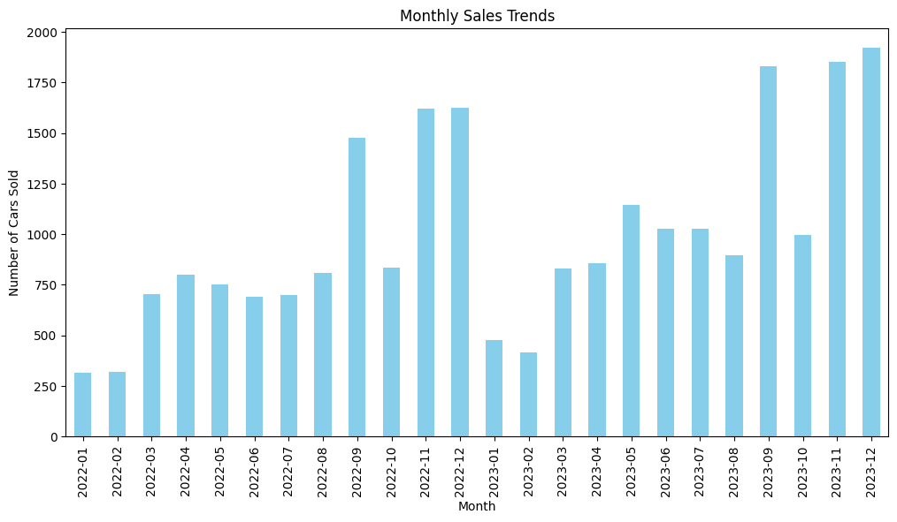
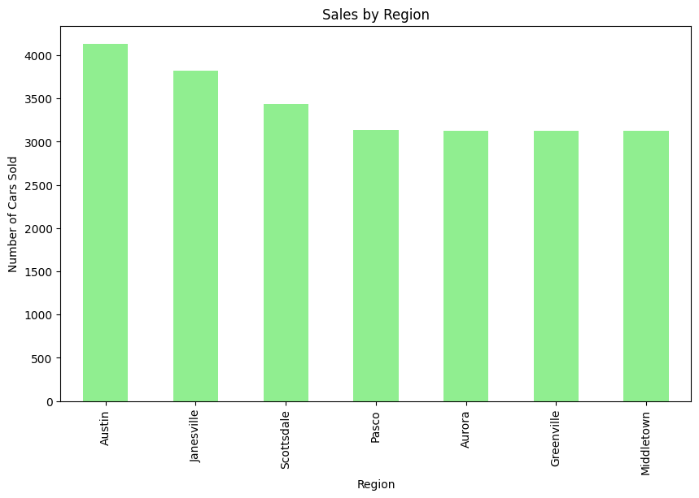
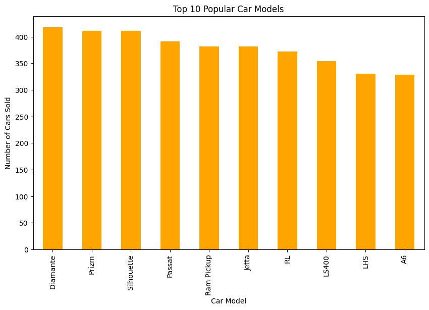
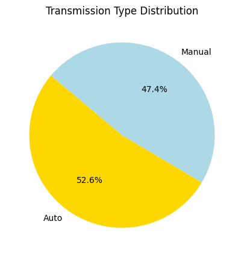
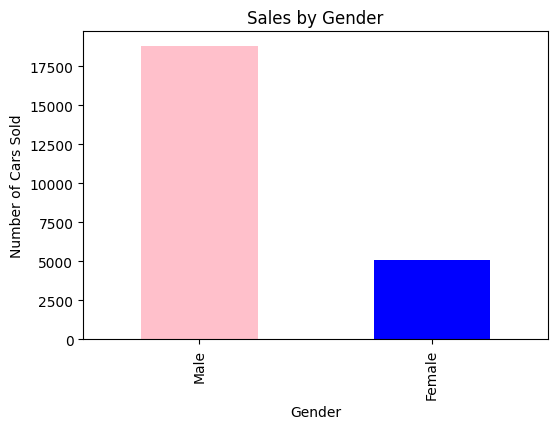
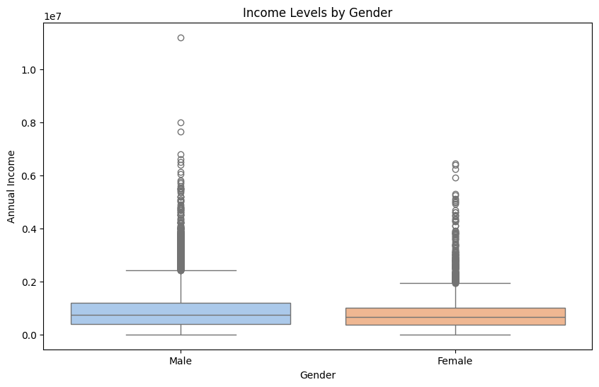

# Car Sales Analysis 2022-2023

## Overview

This project provides an in-depth analysis of car sales data from 2022 to 2023, focusing on uncovering trends, patterns, and actionable insights to support business decision-making in the automotive and retail industries.

## Industry Focus: Automotive and Retail Analytics

## Result

### Sales trend

### Product insight

### Customer behaviour

## Problem Statement

Understanding key trends and patterns in car sales can help dealerships and manufacturers optimize their strategies, improve customer satisfaction, and increase revenue. However, the lack of actionable insights from existing sales data limits the ability to make informed decisions.

## Business Use Case

This project aims to address the following questions:

- **Sales Trends:** What are the sales trends by month, region, and dealership?
- **Product Insights:** Which car models and features (e.g., engine type, transmission, body style) are most popular?
- **Customer Behavior:** How does customer segmentation (e.g., gender, income level) influence purchasing behavior?

## Goals and Metrics

### Goals

- Provide a detailed analysis of car sales trends.
- Identify factors driving sales performance.
- Offer actionable recommendations for business growth.

### Metrics

- Total sales revenue.
- Monthly sales trends.
- Customer segmentation breakdown.

## Deliverables

- Jupyter Notebook with Python code for data analysis.
- Visualizations summarizing key insights.
- Cleaned and processed dataset.
- Business recommendations document.

## Dataset List

- **Dataset:** Global Car Sales Data (2022-2023)
- **Source:** Kaggle - Car Sales Report Dataset
